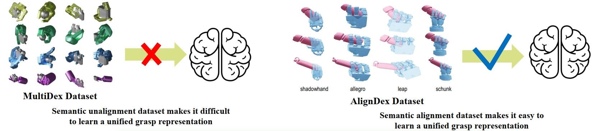

<br>
<p align="center">
<h1 align="center"><strong> AlignDex: Learning Unified Dexterous Grasp Policies from Semantically Aligned Multi-Hand Data
</strong></h1>
  <p align="center">
      <strong><span style="color: red;">PRCV2026</span></strong>
    <br>
   <a >Wei Wang</a>&emsp;
   <a >Yuliang Wu</a>&emsp;
   <a >Ancong Wu</a>&emsp;


  </p>
</p>

</div>


<div align="center">
    
</div>

# 📚 Datasets
To be continued

## 🛠️ Setup
- 1. Create a new `conda` environemnt and activate it.（My CUDA version (nvcc --version) is 11.7）

    ```bash
    conda create -n ald python=3.8
    conda activate ald
    pip install torch==1.11.0+cu113 torchvision==0.12.0+cu113 --extra-index-url https://download.pytorch.org/whl/cu113
    ```

- 2. Install the required packages.
    You can change TORCH_CUDA_ARCH_LIST according to your GPU architecture.
    ```bash
    TORCH_CUDA_ARCH_LIST="7.0;7.5;8.0;8.6" pip install -r requirements.txt
    ```
    Please install in an environment with a GPU, otherwise it will error.
    ```bash
    cd src
    git clone https://github.com/wrc042/CSDF.git
    cd CSDF
    pip install -e .
    cd ..
    git clone https://github.com/facebookresearch/pytorch3d.git
    cd pytorch3d
    git checkout tags/v0.7.2  
    FORCE_CUDA=1  TORCH_CUDA_ARCH_LIST="7.5;8.0;8.6"  python setup.py install
    cd ..
    ```
- 3. Install the Isaac Gym
    Follow the [official installation guide](https://developer.nvidia.com/isaac-gym) to install Isaac Gym and its dependencies.
    You will get a folder named `IsaacGym_Preview_4_Package.tar.gz` put it in ./src/IsaacGym_Preview_4_Package.tar.gz
    ```bash
    tar -xzvf IsaacGym_Preview_4_Package.tar.gz
    cd isaacgym/python
    pip install -e .
    ```

### Train

- Train with multiple GPUs

    ```bash
    bash scripts/grasp_gen_ur/train_ddm.sh ${EXP_NAME} ${GPU_LIST}
    ```

### Sample

```bash
bash scripts/grasp_gen_ur/sample.sh ${exp_dir} [OPT]
```
- `[OPT]` is an optional parameter for Physics-Guided Sampling.

### Test 

First, you need to run `scripts/grasp_gen_ur/sample.sh` to sample some results. 

```bash
bash scripts/grasp_gen_ur/test.sh ${EVAL_DIR} ${ROBOT_NAME} ${DEVICE_ID} 
# e.g., bash scripts/grasp_gen_ur/test.sh  outputs/2026-04-03_09-38-08/eval/final/2026-04-03_14-56-16leap leap 0
```

